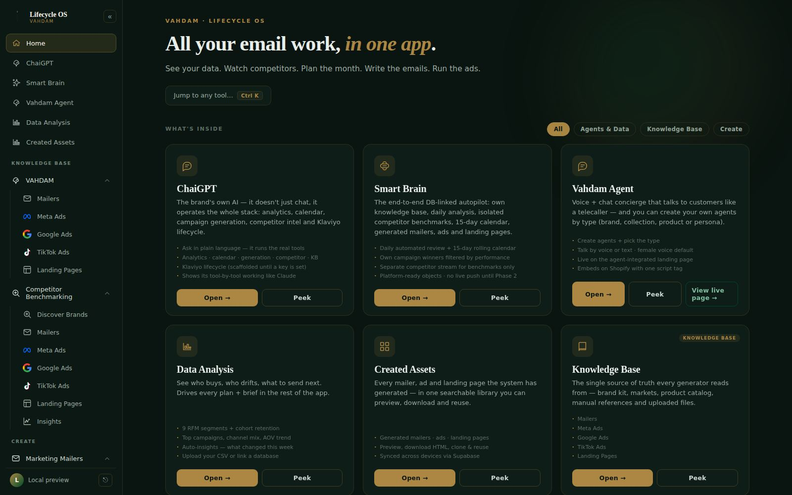
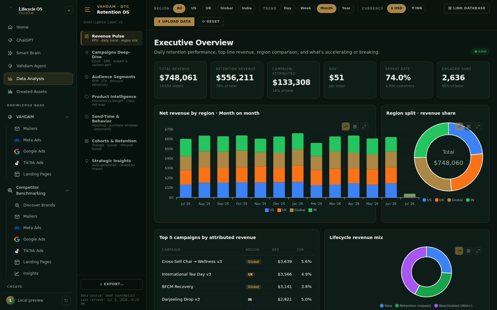
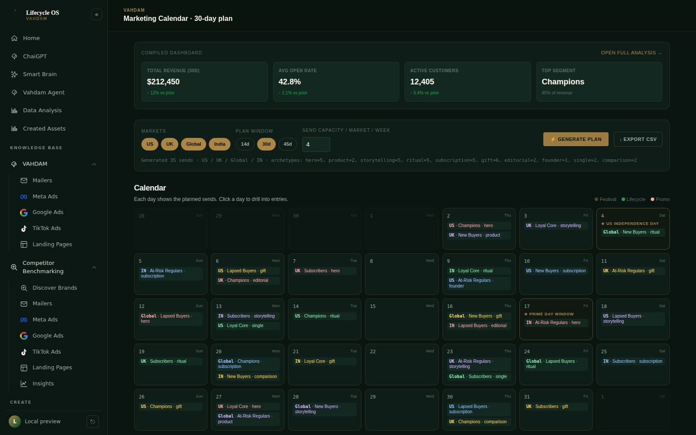
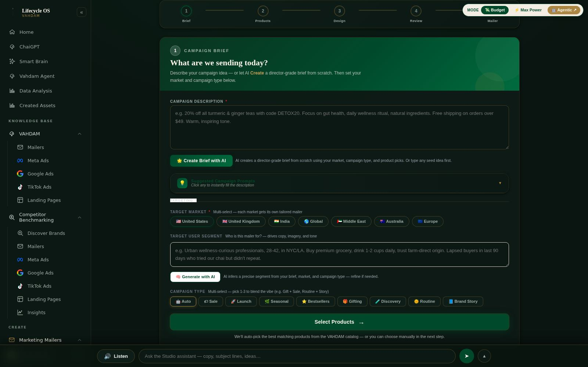
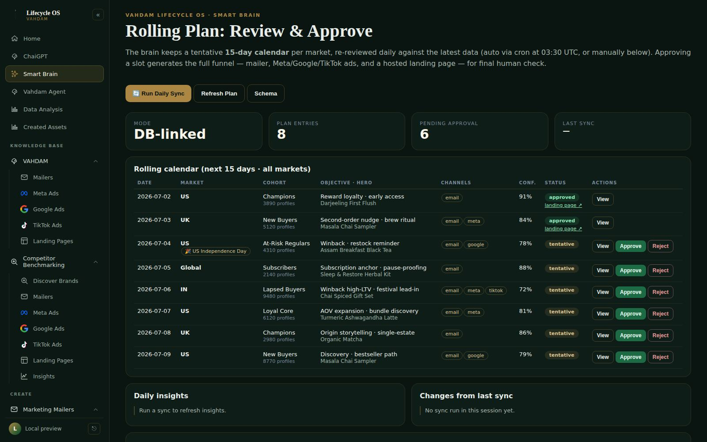
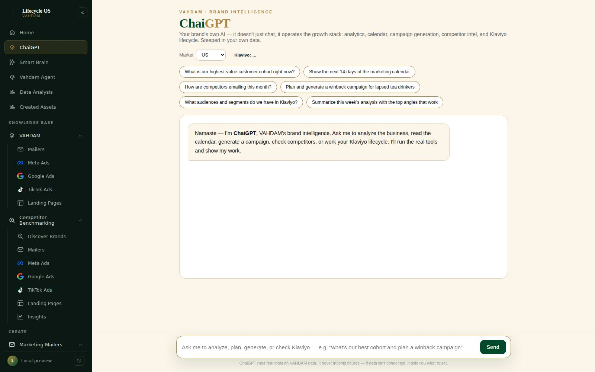
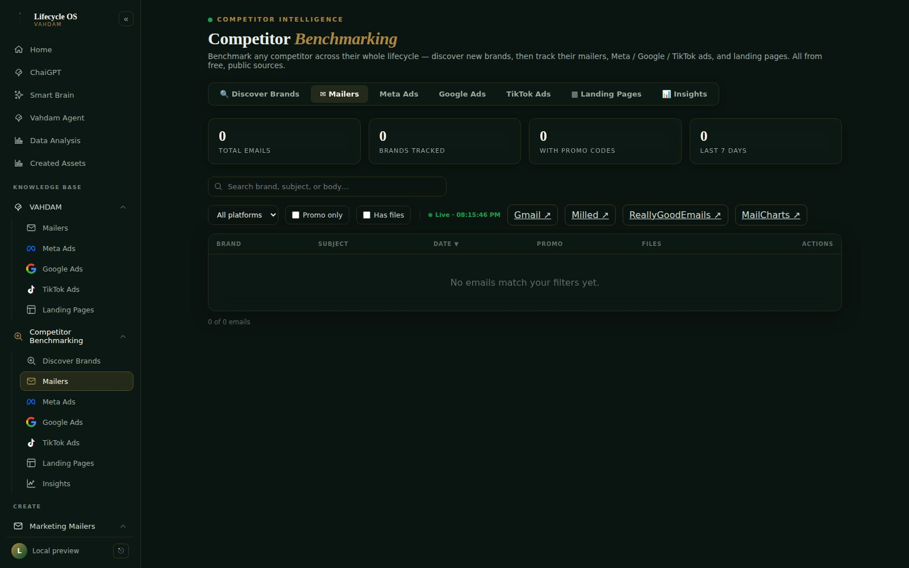
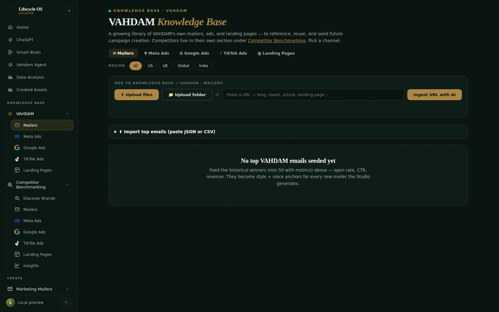
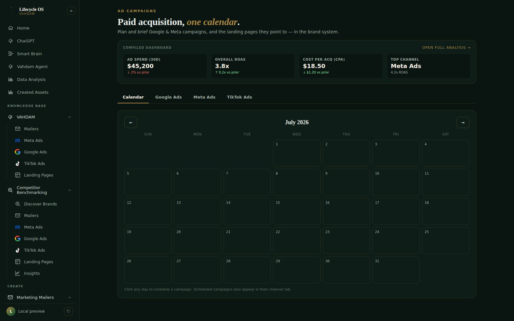
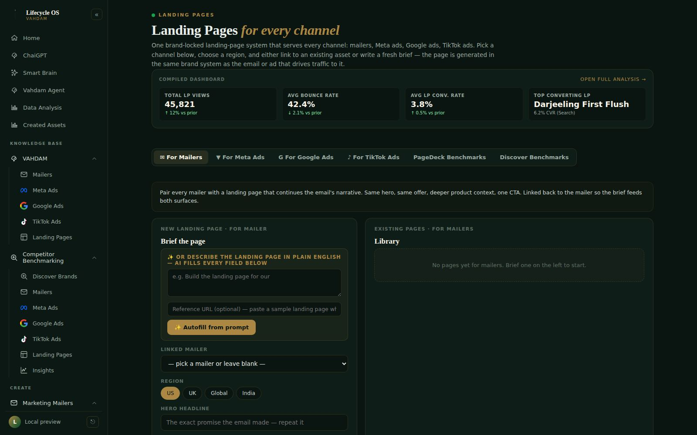

# VAHDAM Lifecycle OS — Product Requirements Document

**Status:** v1.1 (complete) · **Owner:** Anchit Tandon (anchit.tandon@vahdam.com) · **Last updated:** 2026-07-06
**Supersedes:** v1.0 of 2026-07-02, and the v0.1 draft of 2026-06-04 (both preserved in git history — the draft documents the original consolidation thinking and is quoted where the "origin" of a feature matters).
**What changed in v1.1 (2026-07-06):** the V1/V2 version taxonomy (§1.4) is now recorded; the demo/mock access gate has been removed, so every signed-in user gets full live access (§9); the app UI is locked to a single forest-green theme, with the dark/dusk/light switcher removed (§7.1/§8); domain + OAuth migration tooling was added (§7.5); and the milestones (§11) run through 2026-07-06.

**Live app:** https://vahdam-marketing-mailers-architect.vercel.app/ · **Presentation deck:** [`/prd-deck`](../docs/prd-deck.html) · **Repo:** `Anchit-AI-Hustle/vahdam-lifecycle-os`

---

## 0. Executive summary

**VAHDAM Lifecycle OS is one application that runs the entire retention + acquisition growth loop for VAHDAM Teas:** read the customer data → watch what competitors send → plan the month → generate brand-locked mailers, ads and landing pages → review, approve and learn — with an AI "Smart Brain" doing the daily loop automatically and a brand LLM ("ChaiGPT") that can operate every tool conversationally.

It replaced a scatter of disconnected tools (a dashboard here, a mailer builder there, competitor spreadsheets, ad-hoc briefs) with **one Vercel-hosted app, one login, one design system, one shared data layer** — built and operated at effectively **zero fixed infrastructure cost** (Vercel Hobby + Supabase free tier + free-tier LLM fallbacks), which is itself a deliberate engineering constraint that shaped the architecture (§7).

The system today: **11 user-facing modules**, **12 serverless functions** (the exact Vercel Hobby cap), an **eleven-rung LLM waterfall**, a **4-provider image cascade**, **40+ database tables**, **376 active products across 3 regional catalogs**, an installable **PWA + native Android/iOS super-app shells** (code fully in this repo, auto-synced to production by architecture), and a daily **03:30 UTC autonomous planning cron** with human approval gates.

---

## 1. Vision

### 1.1 The one-line vision
> Read your data → see what competitors are doing → plan the calendar → write the email or ad → ship the landing page → let the Brain repeat it every day. **One app, one design system, one login — and eventually, one autopilot.**

### 1.2 The final vision (north star)
The end state this project is building toward, in order of maturity:

1. **A self-driving lifecycle department.** The Smart Brain keeps a rolling 15-day campaign calendar per market, re-planned every morning against fresh data, festivals and competitor moves. Humans stop *producing* campaigns and start *approving* them: every slot arrives with the full funnel already generated — mailer, Meta/Google/TikTok ads, and a hosted landing page — and one click ships or rejects it. Rejection feedback trains the next plan.
2. **The brand's own AI employee.** ChaiGPT is the interface for everything: "plan a winback for lapsed UK tea drinkers and generate the assets" is a conversation, not a workflow. It operates the same tools the UI does, quotes real figures with evidence, and refuses to invent data.
3. **Closed-loop distribution.** Today generation stops at platform-ready objects (`push_status: not_integrated_phase_2`). Phase 2 wires Klaviyo (already fully scaffolded — every operation returns its exact would-be API request until a key is set) and the ad platforms so approved campaigns *send themselves*, and performance flows back into the Brain's winner-detection thresholds.
4. **Compounding intelligence.** Every asset generated, every competitor email captured, every approval/rejection and every campaign metric lands in the Knowledge Base — so the system's taste and hit-rate improve with use. The long-term moat is not any single generator; it is the accumulated, brand-locked corpus + feedback loop.
5. **Everywhere the team is.** The same OS installs as a PWA and ships as native Android/iOS super apps (one app containing the whole toolkit), so a plan can be approved from a phone.

### 1.3 Why "OS"
The name is deliberate. This is not a mailer tool with extras; it is an **operating system for the growth function**: shared auth/navigation shell, shared brand kernel (palette/typography/voice enforced in every generator), shared data layer, shared AI services — and applications (Analytics, Calendar, Studio, Competitor Intel, KB, Ads, Landing Pages, Brain, ChaiGPT) running on top of it.

### 1.4 Version taxonomy (V1 vs V2) — product-owner convention (2026-07-03)
As the OS matured, a two-generation convention was adopted so menus, hubs and this document can speak precisely about what is the legacy base versus the newer Lifecycle-OS layer:

- **V1 = the legacy base app** — everything that existed before 2026-07-03: the dashboard/analytics, the `/plan` 30-day RFM calendar, the Mailer Studio (`/studio`), Competitor Benchmarking, Knowledge Base, Ad Campaigns, Landing Pages, ChaiGPT, and the Smart Brain.
- **V2 = the Lifecycle OS additions of 2026-07-03** — the cohort mailer-calendar system (`/mailer-calendar`), the UK non-engagers campaign hub (`/uk-non-engagers`), tier-routed LLM/image cascades plus a video-core, the Social Media OS (`/social`), the retention/influencer knowledge library (`knowledge/retention/`), and the standing left-hand-nav information-architecture rule.

V1 features are upgraded by customising the base version only where needed. Where a capability exposes both generations, the earlier build is labelled **Draft 1** and the current one **Draft 2** (e.g. Plan Calendar V1 = Draft 1 vs Mailer Calendar V2 = Draft 2 of calendaring; Mailer Studio V1 = Draft 1 vs the Mailer Calendar's built mailers = Draft 2 of mailer creation). The nav shows a quiet V1/V2 chip; Draft 1/2 lives in tooltips and info panels.

---

## 2. Origin story — how this project came to be

The chronology matters because every module was pulled into existence by a concrete operational pain, not speculatively:

1. **It started as the Mailer Studio** (`vahdam_mailer_architect_v34.html` — the "v34" records 34 iterations of a single-file app). The original need: producing brand-correct lifecycle emails was slow, inconsistent, and dependent on a designer's availability; generic AI output drifted off-brand (wrong greens, wrong fonts, "wellness journey" copy). The answer was a wizard that bakes the brand style guide into the generation itself.
2. **Generation needs targeting** → the **Data Analysis dashboard** was built so briefs come from RFM segments, cohort retention and send-time behavior instead of guesswork.
3. **Targeting needs cadence** → the **Marketing Calendar** turned analytics into a 30-day, festival-aware send plan that feeds the Studio one click per row.
4. **Cadence needs context** → the **Competitor Benchmarking** system began capturing every competitor email automatically (a dedicated Gmail inbox + IMAP sync into a Google Sheet), then grew ad libraries and landing-page tracking, because promo cadence decisions are made relative to the market.
5. **All of it needs memory** → the **Knowledge Base** became the single source of truth for the brand kit, historical winners, and reference assets that seed future generation.
6. **Email is half the funnel** → **Ad Campaigns** and **Landing Pages** extended the same brand-locked generation to paid acquisition and to the pages traffic lands on.
7. **The loop should run itself** → the **Smart Brain** (built as an MVP on 2026-06-10, hardened through June) wired all of the above into a persistent daily plan→generate→review loop with human approval.
8. **The whole stack should be conversational** → **ChaiGPT** (2026-06-26) put a tool-calling brand LLM on top of every core, and the **Klaviyo scaffold** prepared the send-side integration.
9. **It should be in your pocket** → PWA installability (2026-06-19) and native **Android/iOS Capacitor super apps** (2026-07-01).

Two structural decisions from the v0.1 draft era still define the product:
- **Consolidation over federation** (June): the separately-deployed competitor hub and sibling experiments were folded into this single repo/app, because "the team re-derives the same context in every tool" was the #1 pain.
- **Stay within free limits until the value is proven**: Vercel Hobby's 12-function cap was treated as a design constraint, not a blocker — producing the `?action=` router architecture (§7.2) that still keeps marginal feature cost near zero.

---

## 3. Problem statement

Before Lifecycle OS, VAHDAM's growth work was spread across disconnected surfaces. Concretely, the team:

- re-derived the same customer context in every tool (dashboard exports → slide decks → briefs → email builder);
- had no single place to see **their own plan next to competitor activity** (email *and* ads);
- produced creative that drifted off-brand — off-palette tints, wrong typefaces, banned discount-panic copy ("hurry", "last chance") — because every generator and freelancer started from scratch;
- had no shared, growing library of what was made and what worked;
- relied on fragile manual data syncs, and had **no always-on process**: if nobody planned the month, there was no plan.

**The product bet:** consolidate the loop into one app, enforce the brand at the generation layer (not at review time), and progressively automate the loop until humans only approve.

---

## 4. Personas & jobs-to-be-done

| Persona | Jobs the OS does for them |
|---|---|
| **Retention manager** | Read RFM/cohort truth; approve the rolling calendar; trigger/inspect mailers; watch repeat-rate and winback performance. |
| **Creative / copy** | Generate brand-locked mailer + ad copy and imagery; browse the KB for anchors; clone and re-prompt past assets. |
| **Growth / paid lead** | Plan Google/Meta/TikTok campaigns and landing pages on one calendar; get baked-text ad creatives per size; benchmark competitor ads. |
| **Competitive analyst** | Browse every competitor mailer (full HTML + promo codes), ad-library deep links, tracked-brand registry, offers/funnel intel. |
| **Founder / business leader** | One URL (and one phone app) to see the whole growth function: data, plan, assets, competitor moves, and what the Brain proposes next. |
| **The Smart Brain itself** (machine persona) | First-class consumer of every API: it needs the same cores humans use, which is why all logic lives in shared modules rather than UI code. |

---

## 5. The domains (Growth OS map)

The OS is organized into **eight domains**. Each domain has a UI surface, an API core, and (since June) a slash-command "team member" in `.claude/commands/` that operates it agentically:

| # | Domain | Surface(s) | Backbone |
|---|---|---|---|
| 1 | **Intelligence / Analytics** | `/analytics` (Data Analysis), Cohort Definitions | client analytics engine + Supabase + offline DuckDB pipeline |
| 2 | **Planning** | `/plan` (30-day calendar), Smart Brain rolling 15-day plan | `calendar-generate`, `smart-brain-plan`, festivals data |
| 3 | **Creative — Email** | `/studio` (Mailer Studio) | 5-stage AI pipeline, 11 archetypes, 4 variants |
| 4 | **Creative — Paid** | `/ads` (Ad Campaigns), `/landing` (Landing Pages) | ad compositor + LP compiler + `/lp/:id` hosting |
| 5 | **Competitive Intelligence** | `/competitor` (Benchmarking hub) | IMAP capture → Sheet/Supabase `ci_*`, ad libraries, workers |
| 6 | **Knowledge / Memory** | `/kb` (Knowledge Base), `/assets` (Created Assets) | `kb_*` tables, ingest-with-AI, asset hub |
| 7 | **Autonomy** | `/brain` (Smart Brain console), daily cron | 6 services + rolling plan + HITL review |
| 8 | **Conversation / Voice** | `/chaigpt` (ChaiGPT), `/agent` (Vahdam Agent) | brand-llm tool loop, evidence contract, TTS |

Cross-cutting: **Brand kernel** (§8), **Klaviyo lifecycle** (scaffolded, §6.12), **Mobile super apps** (§6.14), **Ship/Deploy** (Vercel).

---

## 6. Feature specifications

Every feature below follows the same lens: **Origin → Need → Purpose → What it does → How it works → Future.**

---

### 6.1 Home — the portfolio hub (`/`, `index.html`)

- **Origin.** As modules multiplied, the home page was rebuilt (2026-07-01) from a static landing page into an "interactive portfolio hub" after the team kept losing track of what existed.
- **Need.** Eleven tools are only useful if you can find them; new stakeholders need a 30-second mental model.
- **Purpose.** One screen that always mirrors the entire OS and teaches the pipeline.
- **What it does.** Card grid of every tool with **Open / Peek** (live iframe preview) actions, section filter chips (Agents & Data / Knowledge Base / Create), a **⌘K command palette** ("Jump to any tool…"), a 4-step pipeline strip (*Look at data → Plan a month → Write emails → Send & compare*) with a **Run Autopilot** shortcut into the Smart Brain, and a live health dot polling `/api/public-config?health=1`.
- **How it works.** Pure client JS; the card grid is generated from `window.__LC_NAV` — the same nav model `auth.js` renders — so the homepage can never drift out of sync with the sidebar.
- **Future.** Role-based default views; surfacing "what the Brain did overnight" as the hero.

### 6.2 Data Analysis (`/analytics`, `dashboard.html`)

- **Origin.** Built immediately after the Mailer Studio because generation without targeting produced pretty emails to the wrong people.
- **Need.** Retention decisions (who to mail, when, with what) were made from stale exports; nobody could answer "which segment is drifting?" live.
- **Purpose.** The intelligence layer that drives every plan and brief downstream — "see who buys, who drifts, what to send next."
- **What it does.** Seven analysis views: **Revenue Pulse** (KPIs, daily trend, region mix), **Campaigns Deep-Dive** (email/SMS subject & content performance), **Audience Segments** (**9 RFM segments** + behavioral overlays: discount sensitivity, category affinity, engagement decay 30-vs-90-day), **Product Intelligence** (promoted-vs-bought, cross-sell map), **Send-Time & Behavior** (heatmaps, purchase windows, seasonality), **Cohorts & Retention** (triangle, curves, lifecycle funnel), and **Strategic Insights** (auto-generated, ranked by impact). Region (US/UK/Global/India) and currency (USD/INR) switches; trend granularity day→year.
- **Data in/out.** Three source modes — synthetic seed (demo), **CSV/XLSX upload** (append or replace), or **Link a database** (Supabase/REST endpoint; analysis then scopes to that DB only until reset). Exports CSV and color-preserving XLSX. Results persist to localStorage and feed the Calendar and Studio.
- **How it works.** Fully client-side analytics engine (~2,300 lines) with ApexCharts; a reproducible Google-Sheets dashboard generator (2026-06-30) mirrors the key views into a shareable Sheet. The offline **DTC data engine** (`ingest/`, DuckDB → `dtc.*` Supabase tables) supplies real Matrixify/Shopify/Klaviyo/WebEngage exports.
- **Future.** Warehouse connectors via server proxy; scheduled refresh; anomaly alerts pushed into the Brain's daily insights.

### 6.3 Cohort Definitions (`/cohorts`, `cohort-definitions.html`)

- **Origin.** Written down after segment names started meaning different things to different people ("lapsed" = 60 or 120 days?).
- **Need.** A canonical, human-readable segmentation contract shared by analytics, calendar and generation.
- **What it does.** Documents **12 lifecycle cohorts across 5 stages** — NEW (Prospect, First-Time Buyer 0–45d, Second-Order Pending), ACTIVE (Repeat/Habitual, Growing Basket, Subscriber), VIP (Loyal Core, High-Value VIP), RISK (At-Risk Regular, One-and-Done Stalling), LAPSED (Lapsed Buyer, Dormant/Churned) — each with definition, audience mindset, and trigger strategy. The Brain's runtime engine uses a compatible operational set (Champions, Loyalists, New Buyers, Winback High-LTV, At-Risk, Nurture).
- **Future.** Make definitions executable (one JSON contract consumed by dashboard + Brain instead of parallel definitions).

### 6.4 Marketing Calendar (`/plan`, `calendar.html`)

- **Origin.** The step that connected analytics to production: once segments were visible, the question became "so what goes out on Tuesday?"
- **Need.** Month planning lived in spreadsheets, disconnected from both the data and the email builder; festivals were remembered too late.
- **Purpose.** Turn the analytics state into a concrete, capacity-constrained 30-day send plan — then hand each row to the Studio with one click.
- **What it does.** Generates a **30-day plan** across selected markets (US/UK/Global/IN) with per-market weekly send capacity: each entry = date × market × segment (with live segment size) × content type (promo/editorial/lifecycle/launch/winback) × one of the 11 layout archetypes × hero product × subject-line hint, festival-weighted (`data/festivals.json`) and send-time tuned. Renders a month grid + filterable table; CSV export; a compiled mini-dashboard (revenue, open rate, active customers, top segment) on top; **"Generate mailer"** pushes any row through the full strategy→variants pipeline.
- **How it works.** `POST /api/calendar?action=generate` (`_shared/calendar-generate.js`) consumes the analytics summary from localStorage; `?action=trigger-mailer` (`calendar-trigger.js`) feeds the pipeline of §6.5.
- **Future.** Fully absorbed by the Smart Brain's rolling plan (§6.9) — the 30-day generator remains the manual/what-if mode and the 5-scenario engine's base.

### 6.5 Mailer Studio (`/studio`, `vahdam_mailer_architect_v34.html`)

- **Origin.** The founding application — 34 versions of iteration compressed into its filename. Every other module exists to feed or learn from it.
- **Need.** Brand-correct lifecycle emails took days and still drifted: wrong palette tints, wrong fonts, banned urgency copy, inconsistent structure. Generic AI tools made it worse — fluent but off-brand.
- **Purpose.** Produce **production-ready, brand-locked email HTML in minutes**, with enough structural variety that A/B tests are real tests.
- **What it does.** A **5-step wizard**: Brief (free text or "Create Brief with AI" → a director-grade 450–600-word brief; multi-market targeting; 8 campaign types) → Products (auto-picked from the real regional catalog or manual) → Generation → Review & Refine → Final HTML. Produces **4 variants per campaign**: **A** (Image · hero close-up, conversion-led), **B** (Image · lifestyle wide, story-led — structural divergence from A is *forced*, not suggested), **T1** (Text · editorial), **T2** (Text · founder note). **11 layout archetypes** (hero-led-editorial, product-grid-conversion, storytelling-narrative, single-product-spotlight, gift-bundle-showcase, ritual-journey, comparison-discovery, founder-note, editorial-trend-roundup, limited-drop-countdown, subscription-anchor) are mapped per campaign-type × variant. Output is compact (~1200–1500px, "two scrolls"), passes a client-side `brandPaletteCheck()`, uses region-aware store URLs/currency, and scores itself before display. A Budget/Max-Power **tier dial** and an in-page assistant composer round it out.
- **How it works.** Two paths share one contract: a client-side archetype renderer, and the server **5-stage pipeline** (`api/ai/pipeline/*`): **strategy** (Master Strategic Lock: audience truth, product picks, strategy type, image-style lock, A/B concepts — *think*) → **variant** ×2 (*lock*: pure execution, mandatory 7-section structure for A, structural opposite for B) → **images** (up to 3: hero/product/lifestyle, with retries and cascade §7.4) → **html** (responsive email HTML; offer above fold; price always visible; max 7 sections) → **score** (strategy alignment / content density / copy quality / variant divergence; pass gate ≥7, divergence ≥8; failing variants signal a retry). The "think → lock → execute" order exists because earlier "generate then patch" attempts produced incoherent emails.
- **Claims.** Brief-to-4-variants in minutes; zero off-palette output by construction; every mailer traceable to a strategy JSON.
- **Future.** KB-driven few-shot conditioning (retrieval of past winners per archetype/market); Klaviyo template push (Phase 2).

### 6.6 Competitor Benchmarking & Competitive Intelligence (`/competitor`, `competitor-benchmarking.html`)

- **Origin.** Started as a separately-deployed "competitor hub" reading a Gmail inbox; merged into the OS during consolidation, then expanded into a full CI system (June 17–20) with off-Vercel collectors.
- **Need.** Promo-cadence and creative decisions are relative: "should we discount this week?" depends on what Palais des Thés, Art of Tea and 30+ others are sending *right now*. Manually forwarding competitor emails didn't scale and lost the HTML.
- **Purpose.** An always-fresh, searchable archive of competitor lifecycle activity — mailers, ads, landing pages, offers — that both humans and the Brain benchmark against (informing prioritization but *never* qualifying our own winners — the two streams are deliberately isolated).
- **What it does.** Tabs: **Discover Brands** (registry of tracked brands across Tea/Coffee/Supplements × US/UK; live seeded list), **Mailers** (every captured email: brand, subject, promo codes, received-at, full stored HTML rendered in-place, attachments/screenshots; search + platform/promo filters; live 45s polling), **Meta / Google / TikTok Ads** (deep links per tracked brand into the free public ad libraries; collected ads via workers), **Landing Pages**, **Insights**. Also serves the Mailer Discovery view (`/discover`).
- **How it works.** A dedicated capture inbox is auto-subscribed to competitor lists by a local **Playwright worker** (`workers/auto-subscribe.js`); Gmail **IMAP** (`imapflow` + `mailparser`) ingestion parses each mail (subject, body, promo-code regex, inline images, attachments) into the Google-Sheet database (columns A–K, raw HTML capped at 49k) and mirrors into Supabase `ci_emails`; `?action=poll` gives near-real-time freshness while the page is open; a Cloudflare-Email-Routing webhook (`?action=ingest`) offers a zero-cost push path; `ci-collect-*` actions + off-Vercel collectors (`collect-ads.js`, `collect-landing.js`, `collect-wayback.js`) populate ads/landing/offers; `ci-enrich` runs lazy LLM tagging; `ci-funnel` reconstructs funnels. **Auth to Google is keyless** via Workload Identity Federation (§7.5).
- **Claims.** Competitor emails appear in the hub ~minutes after they land; the archive keeps full render-quality HTML, not screenshots of screenshots; $0/month capture stack.
- **Future.** Scale to 50+ sources with a queue+worker model; move artifacts to object storage + CDN; automated creative-tagging into the KB schema.

### 6.7 Knowledge Base (`/kb`, `knowledge-base.html`)

- **Origin.** Grew out of a June restructure ("collapse to VAHDAM + Competitors") when reference material was scattered across drives and chats.
- **Need.** Generators are only as good as their references; the brand needed one growing library of its own assets and curated winners that generation can be anchored to.
- **Purpose.** The **single source of truth every generator reads from** — brand kit, markets, product catalog, historical top emails with metrics, uploaded references, ingested URLs.
- **What it does.** Channel tabs (Mailers / Meta / Google / TikTok / Landing Pages) × region filters; **file/folder upload**; **"Ingest URL with AI"** (fetch → strip → LLM summary with key points + tags); an import path for historical **top emails with performance metrics** (they become style + voice anchors); tracked-brand management; email-type classification (text/html/image-heavy) over the captured competitor corpus.
- **How it works.** `api/kb.js` router (`ingest|list|top-emails|brands|classify-emails`) over Supabase (`kb_knowledge`, `kb_files`, `kb_top_emails`, `competitor_brands`, `competitor_emails_classified`).
- **Future.** Vector embeddings + "find designs like this" retrieval; RAG-conditioning of the Studio and ad builder on brand-compliant exemplars (learn patterns, never copy).

### 6.8 Ad Campaigns (`/ads-master`, `ad-campaigns-master.html`) & Landing Pages (`/landing`, `landing-pages.html`)

- **Origin.** Email covered retention; paid acquisition briefs still lived in slides. Both modules extend the same brand kernel to paid. The landing-page system additionally absorbed a real campaign need — the Ashwagandha-coffee presell funnel — which produced the `/lp/*` hosted-page contract and the battle-tested LP compiler.
- **Need.** Ad creative was produced ad-hoc per platform and size; landing pages required a developer for every campaign; neither enforced the brand system; and **Aman's P01 mandate** — *"sell happiness, not ingredients"* (target women 45+/busy mums, emotional end-state, 1-second scroll-stop, baked-in offer text) — needed to be encoded, not remembered.
- **Purpose.** One calendar for paid; per-platform ad objects with **copy baked into the creative**; landing pages generated in the same brand system as the email/ad that drives traffic to them.
- **What it does.**
  - **Ads:** compiled KPI dashboard (spend, ROAS, CPA, top channel); tabs Calendar / Google / Meta / TikTok; a one-prompt **autofill** that populates every field; a client-side compositor that renders **one still PNG per ad size with the text overlay baked in** (Google 1200×628 & 1200×1200; Meta/IG 1080×1080 & 1080×1920; TikTok 1080×1920). Shipped "sell-happiness" reference creatives (Meta static + Reels video) live in the repo.
  - **Landing Pages:** brief-to-page generation per channel × region, linked back to the mailer so one brief feeds both surfaces; a library of saved pages with **clone-into-editable-entry**; generated pages are **hosted immediately at `/lp/:campaignId`** (dynamic serving via `api/calendar?action=lp`, downloadable as a self-contained file); flagship hand-tuned funnels at `/lp/cortisol-v1|v2`, `/lp/agent`, `/lp/best` — including the all-in-one **voice-agent landing page** where an embedded agent narrates and asks the visitor questions.
- **How it works.** `api/ai/generate.js` (copy) + `api/ai/image.js` `mode:'ad'` (creatives) + `_shared/lp-compiler.js` (themes × funnel variants, ported from the standalone `marketing_automation/` React compiler); persistence in `ads_generated` / `landing_pages_generated`.
- **Future.** Phase-2 platform push (Meta/Google APIs); LP performance capture feeding the Brain.

### 6.9 Smart Brain — the autonomous daily loop (`/brain`, `smart-brain.html`)

- **Origin.** Built as an MVP on **2026-06-10** ("Build Smart Brain MVP") once every manual step existed end-to-end; hardened through June (persistent plan → funnel preview → creatives → dual-mode → scenarios).
- **Need.** The loop worked but only when a human ran it. Growth cadence shouldn't depend on someone remembering to plan; and the "plan" needed to survive across days, not be regenerated from scratch (losing human edits).
- **Purpose.** **The autopilot**: keep a persistent, rolling **15-day calendar per market**, re-reviewed every morning against fresh data, with humans approving — and every approval generating the *complete funnel* automatically.
- **What it does.** Console shows mode (DB-linked/preview), plan entries, pending approvals, last sync; the rolling calendar table (date, market, cohort + live size, objective + hero product, channels, **confidence score**, status pill); **View** previews the full funnel *before* approval (mailer iframe, landing page, per-platform ads with AI creative images, JSON details); **Approve** LLM-writes mailer + Meta/Google/TikTok ads + landing page (hosted at `/lp/:id`), persists to `smart_generated_campaigns` and mirrors to `ads_generated`/`landing_pages_generated`; **Reject** (with notes) feeds recalibration. **Daily insights** and **changes-from-last-sync** panels narrate what the Brain changed and why. **Dual-Mode Generation** panel: Budget vs Max-Power model tier, an 8-stage traced **agentic run** (data → analysis → planning → calendar → content → assets → review → ideation), and a **5-scenario calendar** (best/medium/conservative/emergency/instant pre-staged; a standby scenario can be activated in one click).
- **How it works.** `lib/smart-brain/services.js` — **6 services**: KnowledgeBase (index own campaigns/assets/metrics), Analysis (RFM cohorts; winner detection vs explicit thresholds, e.g. email open ≥22%, click ≥1.8%; product scoring; channel benchmarks), CompetitorBenchmarking (isolated stream — informs prioritization, never qualifies own winners), CalendarIntelligence (festival-aware 15-day plan with confidence + MVT plan; every entry `needs_human_verification`), Generation (audience/retargeting/lookalike specs, funnel, email+LP+ads as platform-ready objects, `push_status:'not_integrated_phase_2'`; `safeCopy` scrubs the banned-phrase list), Review (daily automated review + **mandatory weekly human recalibration**). `_shared/smart-brain-plan.js` makes the plan *persistent*: daily sync **diff-updates only `tentative`/`rejected` entries** — a human approval mid-window always wins over the machine. Daily **Vercel Cron at 03:30 UTC** hits `/api/brain?action=cron` (`CRON_SECRET`-protected). AI creative images are hosted on Supabase Storage.
- **Claims.** A tentative, evidence-scored 15-day plan exists every morning without human input; approval-to-full-funnel is one click; nothing sends without a human (by design, Phase-2 gate).
- **Future.** Phase-2 push to Klaviyo/ad platforms; auto-approve above confidence thresholds with spend caps; performance-informed replanning.

### 6.10 ChaiGPT — the brand LLM (`/chaigpt`, `chaigpt.html`)

- **Origin.** 2026-06-26: "brand LLM that operates the whole growth stack." The insight: the OS had become an API surface an LLM could *drive* — so give the brand its own Claude.
- **Need.** Every tool answers one question; leadership questions span tools ("what's our best cohort, what are competitors doing about it, and what should we send?"). Also: answers must be *grounded* — no invented figures.
- **Purpose.** A conversational operator for the entire stack, with evidence discipline.
- **What it does.** Claude-style chat (market selector, suggestion chips, Klaviyo status pill) that plans multi-step work, calls real tools, and shows a collapsible **tool trace** (every call + args + results). **11 registered tools**: `ask_analytics`, `run_analysis`, `list_cohorts`, `get_calendar`, `get_competitor_benchmarks`, `search_knowledge_base`, `list_campaigns` (reads) + `generate_calendar`, `generate_assets_for_slot`, `run_agentic_campaign`, `klaviyo` (writes — only on explicit ask). The system prompt enforces a **4-point evidence contract**: quote exact tool-sourced figures, name the target metric + expected impact, state a complete hypothesis, quote competitor benchmarks.
- **How it works.** `_shared/brand-llm.js`: a provider-agnostic **tool-calling loop** — the model emits strict JSON (`{action:'tool'|'tools'[≤3 in parallel]|'final'}`), the server executes against the same `_shared` cores the UI routes use, feeds results back, loops (default 5 steps). Because tool calls are plain JSON rather than a provider function-calling API, **the loop works across the entire eleven-rung waterfall including free tiers**. Speed: pins the first provider that answers, dedupes repeated tool+args, 20s per-provider timeout. The product name is one constant (`BRAND_LLM_NAME`) — rebrandable in one line.
- **Future.** Memory across sessions; scheduled "morning briefing" messages; Klaviyo write-ops going live with the key.

### 6.11 Vahdam Agent — buyer-facing voice + chat (`/agent`, `agent.html`, `agent-widget.js`)

- **Origin.** June 13–21: voice/chat agents grew from the landing-page work (an LP that *talks* converts differently) into an app-wide, embeddable concierge.
- **Need.** Distinct from ChaiGPT (internal operator): buyers need a persuasive, KB-grounded concierge that behaves like a telecaller and never leaks internal data.
- **What it does.** Full-screen voice+chat agent; per-type agent creation (brand/collection/product/persona); female-voice default TTS; lives on the agent-integrated landing page and embeds on Shopify with one script tag; spoken-friendly, no-markdown replies. Guardrails: evidence policy + confidentiality firewall (buyer-safe vs internal data classification matrix), anti-scraping, persuasive persona playbook.
- **How it works.** `brain-agent.js` (buyer `agent-chat` vs internal `team-chat` routes), `evidence-policy.js`, `data-classification.js`; TTS via `?action=tts` (ElevenLabs proxy with browser-voice fallback).
- **Future.** Order-aware conversations once commerce APIs are connected; multilingual voice.

### 6.12 Klaviyo integration (scaffolded)

- **Origin.** Built alongside ChaiGPT (2026-06-26) so the send-side integration would be *ready* rather than hypothetical.
- **Need.** Klaviyo is the ESP; Phase 2 (closed-loop sending) needs profiles/segments/campaigns/flows/reporting access.
- **What it does.** `_shared/klaviyo-core.js` mirrors Klaviyo's JSON:API (revision 2024-10-15): **15 operations** — status, profiles, lists, segments, metrics, events, campaigns, flows, templates, campaign reporting, create-profile, subscribe, track-event. **Until `KLAVIYO_API_KEY` is set, every op returns `{connected:false, would_request:{method,url,body}}`** — a structured dry-run stub — so ChaiGPT, the tools UI and the chat flows all work end-to-end today and go live by adding one env var.
- **Claims.** Zero-risk integration: the full request surface is inspectable before any key exists.

### 6.13 Created Assets hub (`/assets`, `assets.html`)

- **Need.** Generated output (mailers, ads, LPs) was scattered per-tool; reuse meant regenerating.
- **What it does.** One searchable, filterable library of **every asset the suite has produced** — preview, download HTML, **clone**, and **copy a portable AI prompt** for any asset (so it can be re-run in any external LLM), categorized by type/market; local-first with Supabase sync.

### 6.14 Mobile super apps — PWA + native Android & iOS

- **Origin.** PWA installability shipped 2026-06-19; native **Capacitor** apps ("Add iOS + Android native apps via Capacitor — WebView shell over live PWA") shipped 2026-07-01.
- **Need.** Approvals and monitoring shouldn't require a laptop; leadership wants the whole OS as **one app on the phone** (a true super app: all eleven tools in one shell).
- **Purpose.** The entire Lifecycle OS, installable from a store or a link, always up-to-date.
- **What it does & how it works.**
  - **PWA:** `manifest.webmanifest` + `sw.js` (`lifecycle-os-v16`) make the web app installable on Android/iOS with an offline shell; navigation is network-first with cache fallback; `/api/*` is never cached; the SW self-heals stale caches.
  - **Native shells:** `capacitor.config.json` (appId `com.vahdam.lifecycleos`, appName "VAHDAM Lifecycle OS") with **`server.url` pointed at the production deployment** — the app is a hardened WebView over the live site. **This is the auto-sync guarantee:** every web deploy *is* a mobile release; the binaries never go stale because the code they render is served from production. **The complete native project code lives in this repo** — `android/` (Gradle project, minSdk 22 / target 34), `ios/` (Xcode project + Podfile), `mobile/` (self-contained Capacitor sub-project), `mobile-shell/` (web dir) — no separate mobile repo to keep in sync.
  - **Downloadable builds:** the **Mobile Builds** GitHub Actions workflow (`.github/workflows/mobile-builds.yml`) builds the binaries and publishes them to the fixed release tag **`mobile-latest`**, giving stable download links:
    - **Android APK (installable directly):** https://github.com/Anchit-AI-Hustle/vahdam-lifecycle-os/releases/download/mobile-latest/vahdam-lifecycle-os.apk
    - **iOS app (unsigned IPA — sideload via AltStore/Sideloadly, or sign for TestFlight):** https://github.com/Anchit-AI-Hustle/vahdam-lifecycle-os/releases/download/mobile-latest/vahdam-lifecycle-os-ios-unsigned.ipa
    - **All builds page:** https://github.com/Anchit-AI-Hustle/vahdam-lifecycle-os/releases/tag/mobile-latest
    - Run the workflow once from the **Actions → Mobile Builds** tab (or push a change under `android/`/`ios/`) to mint/refresh the binaries; it re-publishes to the same links every time.
- **Future.** Play Store / App Store listings (store metadata already scaffolded); push notifications for pending approvals; iOS signing pipeline.

### 6.15 Growth OS slash-command team (`.claude/commands/`)

- **Origin.** 2026-06-21 ("Integrate growth-team slash commands + connector/skill routing") — the realization that the OS's cores + hosted connectors (Klaviyo, Canva, Figma, Ahrefs, Higgsfield…) compose into an agentic *team*.
- **What it does.** Project slash commands operate the brand as a full growth team: `/growth-team` (router), `/campaign-plan`, `/email-flow`, `/mailer`, `/ad-creative`, `/landing-page`, `/design`, `/shopify` (public storefront scraping — Admin API deliberately not authorized), `/analytics`, `/competitor`, `/seo`, `/db`, `/ship`. **Every command enforces the Brand Constants** (§8) and the P01 mandate.

---

## 7. Platform architecture

### 7.1 Shape
- **Frontend:** independent, self-contained static HTML pages (inline CSS/JS; the Studio alone is ~7,700 lines) sharing one auth/nav shell (`auth.js`) and localStorage state. No framework, no build step for pages — deliberate: any page can be understood, patched and shipped in isolation. The UI is locked to a **single forest-green theme** (`theme.css`): the earlier dark/dusk/light switcher was removed on 2026-07-06, so every page renders on the brand's forest-green canvas with gold/cream text and cannot drift to an off-brand light mode.
- **Backend:** Vercel serverless functions under `api/`; heavy logic in `api/_shared/` (underscore paths don't count against the function cap) and `lib/`.
- **Deploy:** single Vercel project (`framework: null`); `npm run build` only rebuilds product catalogs; friendly URLs via `vercel.json` rewrites; CI = HTML smoke check + syntax/function-cap/Playwright gates.

### 7.2 The 12-function constraint (and why the architecture looks like this)
Vercel Hobby caps a project at **12 serverless functions**. The app sits exactly at the cap: `ai/generate`, `ai/image`, `ai/pipeline/{strategy,variant,images,html,score}`, `brain`, `calendar`, `competitor`, `kb`, `public-config`. This forced three patterns that are now product strengths:
1. **`?action=` catch-all routers** — `api/brain.js` alone dispatches ~30 actions; `competitor.js` and `kb.js` likewise. New capabilities cost zero functions.
2. **`_shared/` modules** — all real logic is import-cost-free and reusable by every router *and* by ChaiGPT's tools (one implementation, three consumers: UI, API, LLM).
3. **Rewrite-collapsing** — retired endpoints (`/api/health`, `/api/voice`, `/api/klaviyo`, `/api/smart-brain`) live on as rewrites into surviving routers, so URLs never break.

### 7.3 The eleven-rung LLM waterfall (`_shared/llm.js`)
All text generation goes through one caller: **OpenAI** (3 rotating keys) → **Anthropic** → **Gemini** (free) → **Grok/xAI** → **Groq** (free) → **Cerebras** (free). Features: per-call provider pinning (ChaiGPT's speed trick), Budget/Max-Power tier forcing, quota detection on **HTTP 400 + billing keywords** (both OpenAI and Anthropic return 400, not 429, on exhausted credit — a hard-won lesson), BOM/zero-width stripping, multi-strategy JSON parsing. **Consequence:** the platform *degrades to free tiers instead of failing*, and has no single-vendor dependency.

### 7.4 The image cascade (`api/ai/image.js`)
**Gemini native** (image-out models) → **Gemini Imagen** (paid tier only) → **OpenAI gpt-image-1** (3 keys) → **Pollinations** (free flux-pro → flux-realism → flux) → **on-brand placeholder data-URI** (callers never receive a broken tile). Three prompt modes (photo / full email design / ad-with-baked-text); region-aware currency; per-platform ad sizes.

### 7.5 Keyless Google auth — Workload Identity Federation
The competitor Sheet is accessed **without any stored Google key**: Vercel mints a per-request OIDC token → Google STS exchanges it → the code impersonates the service account (1h cached). Legacy JSON-key mode remains as fallback. Shipped 2026-06-07; documented in `docs/workload-identity-federation.md`.

### 7.6 Persistence
- **Supabase (Postgres):** auth, KB, CI, Smart Brain (~25 timestamped migrations; 40+ tables incl. 14 `smart_*`, 9 `ci_*`, `kb_*`, `ads_generated`, `landing_pages_generated`, `dtc.*` facts; `COMBINED_RUN_THIS.sql` apply-all bundle; RLS hardened; service-role keys never reach the client — `/api/public-config` exposes only URL + anon key).
- **Google Sheet:** the legacy competitor-email database (columns A–K contract).
- **localStorage:** analytics → calendar → studio state handoff; asset drafts.
- **Supabase Storage:** AI creative images for generated campaigns.

### 7.7 Offline data engines (local, not on Vercel)
`ingest/` (Matrixify/Shopify/Klaviyo/WebEngage → DuckDB → Supabase `dtc.*`), `mailer_system/` (Python Claude-API campaign engine with thresholds), `marketing_automation/` (React+Express campaign compiler — origin of the LP compiler), `workers/` (Playwright collectors that hold no cloud keys and POST back to the app).

### 7.8 Product catalogs
Built at every deploy from Shopify exports: **US 173 · UK 101 · Global 102 active products** → compact JSON with handle, price, compare-at, tasting notes, caffeine, cups, category tags; served with CORS + long cache. Verified store URLs per market (US/UK/IN/EU/AU/Global) drive region-correct PDP/collection links in every generated asset.

---

## 8. The brand kernel (non-negotiables enforced in code)

Source of truth: `Brand style guide.pdf`, codified in `_shared/master-prompt.js` and enforced client-side (`brandPaletteCheck`), server-side (`safeCopy` scrub), and in every prompt:

- **Palette — ONLY four colors:** `#004A2B` forest green · `#AB8743` gold · `#171717` near-black · `#FBF5EA` cream. Known drift tints are explicitly banned and were purged.
- **Typography:** headings **Lao MN**, body **Proxima Nova** (with exact fallback stacks and `@font-face` sources). No substitute primaries.
- **Banned phrases:** "wellness journey", "transform", "liquid gold", "game-changer", "LIMITED TIME" (caps), "hurry", "don't miss out", "last chance", "while supplies last".
- **Preferred vocabulary:** ritual, restore, balance, origin, single-estate, hand-picked, steep, heritage, crafted.
- **Voice:** warm, sensory, story-driven; testimonials read as tiny personal stories with region-matched names.
- **P01 ad mandate (Aman):** *sell happiness, not ingredients* — emotional end-state creative for women 45+/busy mums, 1-second scroll-stop, offer text baked into the image ("Starter Pack 65% OFF + free frother + scoop").

**Claim:** brand compliance is a *property of the system*, not a review step. An asset that violates the palette or copy rules is corrected or rejected before a human ever sees it.

---

## 9. Security, auth & data governance

- **App auth:** Google OAuth (PKCE) via Supabase on the shared shell; sessions persist; the login wall is currently relaxed for the internal team (Mailer Studio always open by design); per-page gating can be re-enabled by flag. **Access mode (updated 2026-07-06):** the former demo/mock gate — which put non-`@vahdam.com` signed-in accounts into a simulated read-only mode (a `window.fetch` guard that faked write/generation responses, plus a demo banner) — was **removed**. Every signed-in user now gets full, live access; the `mockMode` / `__VAHDAM_MOCK__` flags remain pinned to `false` for any external reader.
- **Domain + OAuth migration:** moving a project to its `<slug>.anchit-tandon.com` domain is handled by `scripts/migrate-domains.*` (Vercel domain + GoDaddy CNAME) which then hands off to `scripts/migrate-oauth.*`. Because Google sign-in is Supabase-mediated, the change that actually matters is the Supabase Auth redirect allowlist (auto-applied via the Supabase Management API); the Google web-client's JavaScript origin is a Console-only step (no gcloud/API can edit a web OAuth client), for which the tooling emits an exact plan. Detail in `docs/oauth-redirect-migration.md`.
- **Secrets:** live only in Vercel env vars; `/api/public-config` never exposes service-role keys; provider keys never reach the browser.
- **Cron protection:** `CRON_SECRET` guards `?action=cron` and sync; optional `INGEST_TOKEN` guards the email webhook.
- **Keyless where possible:** WIF (§7.5) removed the standing Google key.
- **Buyer/internal firewall:** the buyer-facing agent runs behind a data-classification matrix (buyer-safe ⟷ internal) + evidence policy; internal metrics can't leak into customer chat.
- **Service worker:** never caches `/api/*`; HTML served `must-revalidate`.

---

## 10. Success metrics

**Product/ops metrics**
- Time-to-first-insight; brief-to-4-variants time (target: minutes); approval-to-full-funnel time (one click + generation).
- % of calendar slots planned by the Brain vs manually; approval rate of Brain proposals; rejection-feedback incorporation.
- Competitor coverage: brands tracked, emails/ads captured per week, capture freshness.
- Brand compliance: off-palette/banned-phrase incidents reaching human review (target: 0, by construction).
- Platform: function count ≤12; $0 fixed infra; provider-failure resilience (generation success rate despite quota exhaustion).

**Business metrics (once Phase 2 closes the loop)**
- Repeat rate, winback conversion, campaign-attributed revenue share, AOV expansion per cohort; email open ≥22% / click ≥1.8% thresholds already encoded as the Brain's winner gates.

---

## 11. Milestones (from the commit record)

| Date (2026) | Milestone |
|---|---|
| ~May 30 | Per-project GCP/Gemini key infrastructure across the app portfolio; Mailer Studio v34 exists as the founding app |
| Jun 07 | Lifecycle OS repo takes shape: WIF keyless Google auth; KB restructure (VAHDAM + Competitors); competitor capture hardening; one-prompt autofill across ads + LPs |
| Jun 09 | Mailer Studio consolidated to one file at `/studio`; competitor **auto-subscribe** Playwright worker |
| Jun 10 | **Smart Brain MVP** + persistent 15-day rolling plan, daily cron, approve→generate, hosted LPs |
| Jun 13 | Voice/chat agents; final presell landing pages with embedded voice agent (`/lp/*`) |
| Jun 17–18 | **Competitive Intelligence system** (Supabase `ci_*`, off-Vercel collectors, Sheet→CI bridge); app-wide KB-grounded voice agent |
| Jun 19 | Funnel preview *before* approval; AI creative + copy for every generated asset; **PWA installable**; Capacitor scaffold |
| Jun 20–21 | Smart Brain hardening + master-prompt foundation; **brand asset code engine enforced across all generators**; **P01 "sell happiness" mandate** baked into ad creatives; **growth-team slash commands**; first PRD deck; dual-mode Budget/Max-Power |
| Jun 22–25 | Scenario-calendar engine (5 scenarios); consolidation merges; CI quality gates (syntax, function-cap, Playwright); strict palette lock; agent LLM-first |
| Jun 26 | **ChaiGPT** — the brand LLM operating the whole stack + **Klaviyo scaffold** |
| Jun 27–30 | LP cloning; reproducible Google-Sheets dashboard generator |
| Jul 01 | **Native Android + iOS super apps** (Capacitor over live PWA); interactive portfolio-hub homepage; ChaiGPT faster loop + evidence answers; **asset hub** with portable prompts |
| Jul 02 | **This PRD v1.0 + business presentation deck**; Mobile Builds workflow with downloadable APK/IPA links |
| Jul 03 | **V2 Lifecycle OS layer** (§1.4): cohort **Mailer Calendar** (`/mailer-calendar`), **UK Non-Engagers Hub** (`/uk-non-engagers`), tier-routed LLM/image cascades + video-core, **Social Media OS** (`/social`), retention/influencer knowledge library, and the LHS-nav IA rule; V1/V2 taxonomy adopted |
| Jul 06 | **Demo/mock access gate removed** (every signed-in user gets live access); **UI locked to a single forest-green theme** (dark/dusk/light switcher removed); **domain + OAuth migration tooling** (`migrate-domains`/`migrate-oauth`); brand-compliant campaign **mailer pack**; **PRD v1.1** + refreshed decks (PPT/PDF/Word) |

~190 commits, ~27 days of build velocity, 60+ merged PRs.

---

## 12. Roadmap

**Phase 0 — Consolidation** ✅ *done*: one app, one nav, one design system; competitor hub merged; near-real-time capture; KB; brand kernel enforced.

**Phase 1 — Autonomy with human gates** ✅ *done*: Smart Brain rolling plan + daily cron + full-funnel generation + HITL approve/reject; ChaiGPT operator; dual-mode tiers; scenario calendars; mobile super apps.

**Phase 2 — Closed loop (next)**
- Klaviyo live (add the key; the scaffold already dry-runs every request) — push approved mailers as campaigns/templates; sync segments both ways.
- Ad-platform export (Meta/Google) where APIs allow; LP performance capture.
- Store listings for the Android/iOS apps; push notifications for pending approvals.
- Auto-approve above confidence thresholds with budget caps (opt-in, per-market).

**Phase 3 — Compounding intelligence**
- KB embeddings + RAG conditioning of all generators on brand-compliant exemplars.
- CI at 50+ sources (queue+worker), object storage + CDN for artifacts, observability/alerting.
- Performance-informed replanning (the Brain reads what actually happened, not just what shipped).

**Phase 4 — Scale-out**
- Multi-brand/white-label (the brand kernel is already one module; ChaiGPT is renameable via one constant).
- Warehouse connectors; role-based access; Vercel Pro when function/computation demand justifies it.

---

## 13. Risks & mitigations

| Risk | Mitigation (current) |
|---|---|
| LLM provider quota/price shifts | eleven-rung waterfall with free-tier floor; per-call pinning; Budget tier default |
| Vercel 12-function cap blocks growth | `?action=` routers + `_shared/` (new features ≈ 0 functions); CI gate counts functions on every PR; Pro upgrade is a decision, not a rewrite |
| Competitor capture blocked (anti-bot, inbox limits) | Multiple paths: IMAP poll, Cloudflare email webhook, off-Vercel Playwright workers; stagger/backoff; store-for-internal-benchmarking policy |
| Brand drift as generators multiply | Single brand kernel consumed by every generator; palette check + copy scrub at generation time; CI palette lock |
| Autonomy sends something wrong | Nothing sends today (Phase-2 gate); every Brain entry `needs_human_verification`; approvals win over daily sync; weekly human recalibration is mandatory |
| Google-key leakage | Eliminated: WIF keyless auth; remaining secrets server-side only |
| Single-maintainer bus factor | This PRD; `docs/` runbooks (GO_LIVE, SESSION-HANDOFF, ARCHITECTURE); CLAUDE.md project memory; slash-command playbooks |
| iOS distribution friction (signing) | Unsigned IPA + sideload path now; store pipeline in Phase 2 |

---

## 14. Open questions

1. When does Phase 2 unblock — who owns the Klaviyo key and the send-approval policy?
2. Auto-approve thresholds: what confidence × spend cap is leadership comfortable delegating?
3. Store presence: publish the Android app publicly or distribute internally (APK link) only?
4. CI legal posture at 50+ sources: confirm scope with counsel before scaling capture.
5. Vercel Pro trigger: which concrete limit (function count, cron frequency, execution time) pulls the trigger?

---

## Appendix A — Route map

| Route | Page/behavior |
|---|---|
| `/` | Home portfolio hub |
| `/analytics` | Data Analysis dashboard |
| `/plan` | 30-day Marketing Calendar |
| `/studio` · `/app` · `/mailer` | Mailer Studio |
| `/brain` · `/smart-brain` | Smart Brain console |
| `/chaigpt` · `/chai` · `/ask` | ChaiGPT |
| `/competitor` · `/discover` | Competitor Benchmarking |
| `/kb` · `/knowledge-base` | Knowledge Base |
| `/ads` | Ad Campaigns |
| `/landing` · `/landing-pages` | Landing Pages |
| `/assets` | Created Assets hub |
| `/cohorts` | Cohort Definitions |
| `/agent` | Vahdam Agent (buyer-facing) |
| `/lp/:id` (+ `/lp/cortisol-v1|v2`, `/lp/agent`, `/lp/best`) | Hosted landing pages |
| `/deck` | Original pitch deck · `/prd-deck` → this PRD's presentation deck |
| `/api/health`, `/api/public-config` | Health/config |

## Appendix B — API action surface (abridged)

- `api/brain.js`: ~30 actions — ops (`status`,`config`), KB, analysis (`analyze`,`cohorts`,`scores`), competitor (`benchmarks`), calendar (`calendar-generate`,`festivals`,`mvt`), generation (`generate`,`assets`,`campaigns`), review (`review`,`decide`,`recalibrate`), agents (`agent-chat`,`team-chat`,`jarvis`), `agentic-run`, `calendar-scenarios`, `brand-chat`, `brand-tools`, `klaviyo`, `tts`, `cron`.
- `api/calendar.js`: `generate`, `trigger-mailer`, `lp`, `smart-brain-{plan,sync-daily,preview,approve,reject,activate-scenario,run-daily,generate-slot,feedback,weekly-recalibration,…}`.
- `api/competitor.js`: `list`,`html`,`poll`,`sync`,`seed`,`ingest`,`adlibrary`,`discover`,`ci-*` (collect/brands/ads/emails/landing/offers/enrich/funnel/daily).
- `api/kb.js`: `ingest`,`list`,`top-emails`,`brands`,`classify-emails`.
- `api/ai/*`: `generate` (concepts/brief/mailer_full), `image` (photo/design/ad), `pipeline/{strategy,variant,images,html,score}`.

## Appendix C — Environment variables

Text: `OPENAI_API_KEY`(+`_2`,`_3`), `ANTHROPIC_API_KEY`, `GEMINI_API_KEY`, `XAI_API_KEY`, `GROQ_API_KEY`, `CEREBRAS_API_KEY`. Storage: `SUPABASE_URL`, `SUPABASE_ANON_KEY` (+ service-role server-side). Lifecycle: `KLAVIYO_API_KEY` (+`KLAVIYO_PUBLIC_KEY`, `KLAVIYO_REVISION`). Voice: `ELEVENLABS_API_KEY`. Google/Sheets: `GCP_WORKLOAD_IDENTITY_PROVIDER`, `GCP_SERVICE_ACCOUNT_EMAIL`, `GOOGLE_SHEET_ID`, `GOOGLE_SHEET_TAB` (legacy `GOOGLE_SERVICE_ACCOUNT_*`). Protection: `CRON_SECRET`, `INGEST_TOKEN`. Vercel-auto: `VERCEL`, `VERCEL_ENV`, `VERCEL_URL`, `VERCEL_OIDC_TOKEN`.

## Appendix D — Screenshots

Captured 2026-07-02 from the running app (local preview of this repo):

| | |
|---|---|
|  |  |
|  |  |
|  |  |
|  |  |
|  |  |
